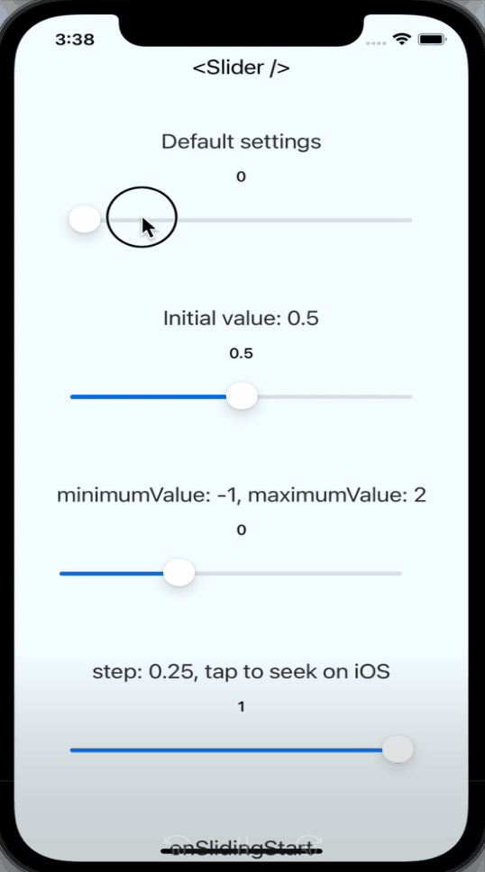
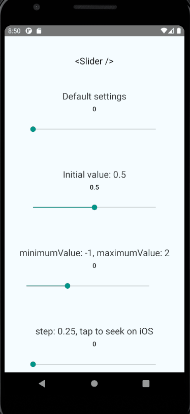
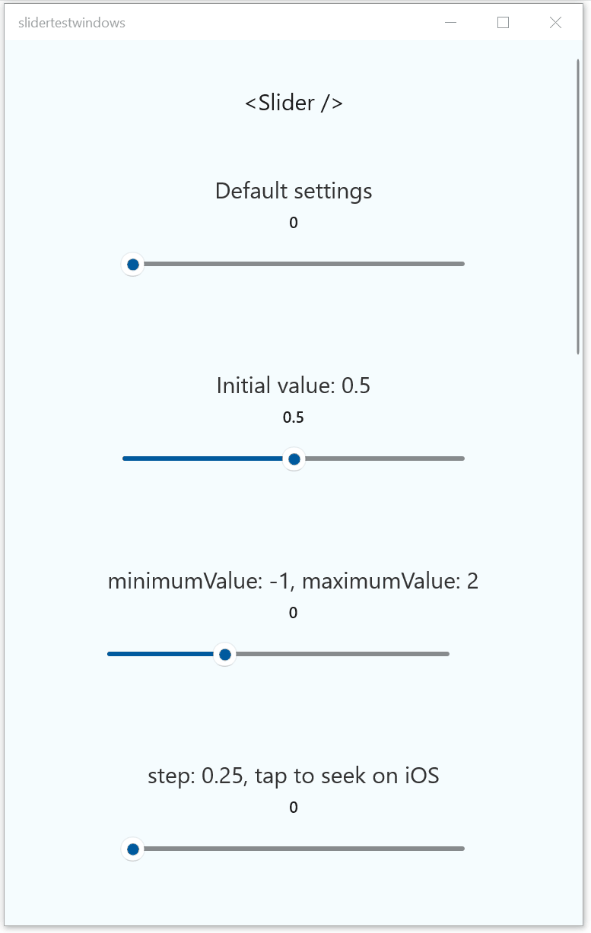

<p align="center">
  <h1 align="center"> <code>@react-native-community/slider</code> </h1>
</p>
<p align="center">
    <a href="https://www.npmjs.com/package/@react-native-community/slider">
        
    </a>
    <a href="https://github.com/callstack/react-native-slider/actions/workflows/ReactNativeSlider-CI.yml">
        
    </a>
    <a href="https://github.com/callstack/react-native-slider">
        
    </a>
    <a href="https://github.com/callstack/react-native-slider/blob/main/LICENSE.md">
        
    </a>
</p>
<p align="center">
  React Native component used to select a single value from a range of values.
  <br>Currently supported on following platforms:
</p>

|iOS|Android|Windows|Web|
|:-:|:-:|:-:|:-:|
|||||

## Installation & Usage

To install this module `cd` to your project directory and enter the following command:
```
yarn add @react-native-community/slider
```
or
```
npm install @react-native-community/slider --save
```
If using iOS please remember to install cocoapods by running: `npx pod-install`

The following code presents the basic usage scenario of this library:
```javascript
import Slider from '@react-native-community/slider';

<Slider
  style={{width: 200, height: 40}}
  minimumValue={0}
  maximumValue={1}
  minimumTrackTintColor="#FFFFFF"
  maximumTrackTintColor="#000000"
/>
```

Check out the [example project](example) for more examples.

### Reach out on Discord

If you have any questions, issues or any other topic that you need an advise in, reach out to us on our channel on Discord under this 👉 [link](https://discord.com/channels/426714625279524876/1339942689524678737).
<br/>See you there!

## React Native Compatibility
To use this library you need to ensure you are using the correct version of React Native.

| `@react-native-community/slider` version | Required React Native Version |
| ---------------------------------------- | ---------------------------- |
| `4.5.1`                                  | `>=0.69`                     |
| `4.3.0`                                  | `>=0.64`                     |
| `4.x.x`                                  | `>=0.60`; `>=0.62` (on Windows); |
| `3.1.x`                                  | `>=0.60`                     |
| `2.x.x`                                  | `>= 0.60`                    |
| [`1.x.x`](https://github.com/react-native-community/react-native-slider/tree/937f0942f1fffc6ed88b5cf7c88d73b7878f00f0) | `<= 0.59` |


## Properties

| Property | Description | Type | Platform |
| -------- | ----------- | ---- | -------- |
| `style` | Used to style and layout the `Slider`. See `StyleSheet.js` and `ViewStylePropTypes.js` for more info. | View.style | |
| `disabled`| If true the user won't be able to move the slider.<br/>Default value is false. | bool | |
| `maximumValue` | Initial maximum value of the slider.<br/>Default value is 1. | number | |
| `minimumTrackTintColor` | The color used for the track to the left of the button.<br/>Overrides the default blue gradient image on iOS. | [color](https://reactnative.dev/docs/colors) | |
| `minimumValue` | Initial minimum value of the slider.<br/>Default value is 0. | number | |
| `lowerLimit` | Slide lower limit. The user won't be able to slide below this limit. | number | Android, iOS, Web |
| `upperLimit` | Slide upper limit. The user won't be able to slide above this limit. | number | Android, iOS, Web |
| `onSlidingStart` | Callback that is called when the user picks up the slider.<br/>The initial value is passed as an argument to the callback handler. | function | |
| `onSlidingComplete` | Callback that is called when the user releases the slider, regardless if the value has changed.<br/>The current value is passed as an argument to the callback handler. | function | |
| `onValueChange` | Callback continuously called while the user is dragging the slider. | function | |
| `step` | Step value of the slider. The value should be between 0 and (maximumValue - minimumValue). Default value is 0.<br/>On Windows OS the default value is 1% of slider's range (from `minimumValue` to `maximumValue`). | number | |
| `maximumTrackTintColor` | The color used for the track to the right of the button.<br/>Overrides the default gray gradient image on iOS. | [color](https://reactnative.dev/docs/colors) | |
| `testID` | Used to locate this view in UI automation tests. | string | |
| `value` | Write-only property representing the value of the slider. Can be used to programmatically control the position of the thumb. Entered once at the beginning still acts as an initial value. Changing the value programmatically does not trigger any event.<br/>The value should be between minimumValue and maximumValue, which default to 0 and 1 respectively. Default value is 0.<br/>_This is not a controlled component_, you don't need to update the value during dragging. | number | |
| `tapToSeek` | Permits tapping on the slider track to set the thumb position.<br/>Defaults to false on iOS. No effect on Android or Windows. | bool | iOS |
| `inverted` | Reverses the direction of the slider.<br/>Default value is false. | bool | |
| `vertical` | Changes the orientation of the slider to vertical, if set to `true`.<br/>Default value is false. | bool | Windows |
| `thumbTintColor` | Color of the foreground switch grip.<br/>**NOTE:** This prop will override the `thumbImage` prop set, meaning that if both `thumbImage` and `thumbTintColor` will be set, image used for the thumb may not be displayed correctly! | [color](https://reactnative.dev/docs/colors) | Android |
| `maximumTrackImage` | Assigns a maximum track image. Only static images are supported. The leftmost pixel of the image will be stretched to fill the track. | Image<br/>.propTypes<br/>.source | iOS |
| `minimumTrackImage` | Assigns a minimum track image. Only static images are supported. The rightmost pixel of the image will be stretched to fill the track. | Image<br/>.propTypes<br/>.source | iOS |
| `thumbImage` | Sets an image for the thumb. Only static images are supported. Needs to be a URI of a local or network image; base64-encoded SVG is not supported. | Image<br/>.propTypes<br/>.source | |
| `trackImage` | Assigns a single image for the track. Only static images are supported. The center pixel of the image will be stretched to fill the track. | Image<br/>.propTypes<br/>.source | iOS |
| [`StepMarker`](#stepmarker) | Component to be rendered for each step on the track,<br/>with the possibility to change the styling, when thumb is at that given step | `FC<MarkerProps>` | iOS, Android, Windows |
| [`renderStepNumber`](#renderstepnumber) | Turns on the displaying of numbers of steps.<br/>Numbers of steps are displayed under the track | bool | iOS, Android, Windows |
| `ref` | Reference object. | MutableRefObject | web |
| `View` | [Inherited `View` props...](https://github.com/facebook/react-native-website/blob/master/docs/view.md#props) | | |

## Custom step marker and step numbers

It is possible to render default step numbers under your slider and to render custom step component and step marker.
<br/>This can be achieved by using:

### `renderStepNumber`

Turns on the displaying of numbers of steps.<br/>Numbers of steps are displayed under the track.
<br/>Two font sizes are available and they will be selected automatically depending on the overall number of steps.

### `StepMarker`

Your custom component rendered for every step on the Slider, both the thumb and the rest of steps along the Slider's whole length.
<br/>This `StepMarker` prop accepts your custom component and provides it with the following parameters:

<table>
<tr>
<td>

```typescript
  stepMarked: boolean;
```

</td>
<td>

Indicates whether that custom step is the one that the thum is currently on.
<br/>If user drags or clicks on that step, thumb will be moved there and the `stepMarked` parameter will be set to `true`.
<br/>Use it, to differentiate between rendering your custom thumb component, or your custom step marker.

</td>
</tr>
<tr>
<td>

```typescript
  currentValue: number;
```

</td>
<td>
Contains the `number` type saying at which value of the Slider the thumb currently is.
<br/>Use it, for example, to render the Slider value on every step marker, or to render different step marker's variant depending on the Thumb position.

</td>
</tr>
<tr>
<td>

```typescript
  index: number;
```

</td>
<td>

Contains the index at which this exact instantiation of your custom step marker was rendered at.
<br/>Use it if you would like to render step number within the step marker, or, for example, if you want to render many variants of step marker depending on their positions along the Slider's width.

</td>
</tr>
<tr>
<td>

```typescript
  min: number;
```

</td>
<td>

Minimum value of the Slider. It is equal to `minimumValue` and has the same default if not set.

</td>
</tr>
<tr>
<td>

```typescript
  max: number;
```

</td>
<td>

Maximum value of the Slider. It is equal to `maximumValue` and has the same default if not set.

</td>
</tr>
</table>

## Roadmap and Progress

There's a Project board available [here](https://github.com/callstack/react-native-slider/projects/1) which contains all reported issues organized into columns regarding their status.

If you are interested in knowing whether the issue you reported is handled or just to check the status of a feature you would like to have in Slider, please check the board.

## Contributing

The main package implementation is done in the `package/` directory.
So when implementing changes there, make sure your code passes ESLint and the tests. Run the following to verify:
```sh
cd package/
npm run lint
npm run test
```

* Remember to cover your changes with tests if possible.

When [creating an issue](https://github.com/callstack/react-native-slider/issues/new/choose) please remember to specify the platform which the issue occurs on.

## Running the example app
While developing, you can run the example app to test your changes.

### Setup

- Clone the repository
- Run `npm install` in the root directory to install dependencies.
- Run `npm run example-<platform>`, where platform can be: `ios`, `android`, `windows`

You can also do this manually by:
- Installing node modules for example app
- Installing pods for iOS app
- Running example app like always: `npx react-native run-<platform>`

### New architecture setup (Fabric)

In order to use the new architecture some extra steps are needed.
#### iOS
- Install pods with new arch flag inside `example/ios` folder: `RCT_NEW_ARCH_ENABLED=1 pod install`
- Run `npm run example-ios`

#### Android
- Set `newArchEnabled` to true inside `example/android/gradle.properties`
- Run `npm run example-android`

<details>
<summary>
If you are using React Native version lower than 0.70, you need to setup manual linking for Android to work.
</summary>

Inside `example/android/app/src/main/jni/Android.mk` add these lines:

```diff
+ include $(NODE_MODULES_DIR)/@react-native-community/slider/android/build/generated/source/codegen/jni/Android.mk
include $(CLEAR_VARS)
```

```diff
    libreact_codegen_rncore \
+   libreact_codegen_ReactSlider \
    libreact_debug \
```

Inside `example/android/app/src/main/jni/MainComponentsRegistry.cpp` update these lines:

```diff
#include <react/renderer/components/rncore/ComponentDescriptors.h>
+ #include <react/renderer/components/ReactSlider/ComponentDescriptors.h>

...

MainComponentsRegistry::sharedProviderRegistry() {
  auto providerRegistry = CoreComponentsRegistry::sharedProviderRegistry();

  // Custom Fabric Components go here. You can register custom
  // components coming from your App or from 3rd party libraries here.
  //
  // providerRegistry->add(concreteComponentDescriptorProvider<
  //        AocViewerComponentDescriptor>());
+ providerRegistry->add(concreteComponentDescriptorProvider<RNCSliderComponentDescriptor>());

  return providerRegistry;
}
```

</details>

## Maintainers

- [Bartosz Klonowski](https://github.com/BartoszKlonowski) - [Callstack](https://callstack.com/)
- [Maciej Łodygowski](https://github.com/draggie) - [Callstack](https://callstack.com/)

## Contributors

This module was extracted from `react-native` core. Please, refer to [contributors graph](https://github.com/react-native-community/react-native-slider/graphs/contributors) for the complete list of contributors.

---

## Made with ❤️ at Callstack

`@callstack/react-native-slider` is an open source project and will always remain free to use. If you think it's cool, please star it 🌟. [Callstack](https://callstack.com/) is a group of React and React Native geeks, contact us at [hello@callstack.com](mailto:hello@callstack.com) if you need any help with these or just want to say hi!

Like the project? ⚛️ [Join the team](https://callstack.com/careers) who does amazing stuff for clients and drives React Native Open Source! 🔥
