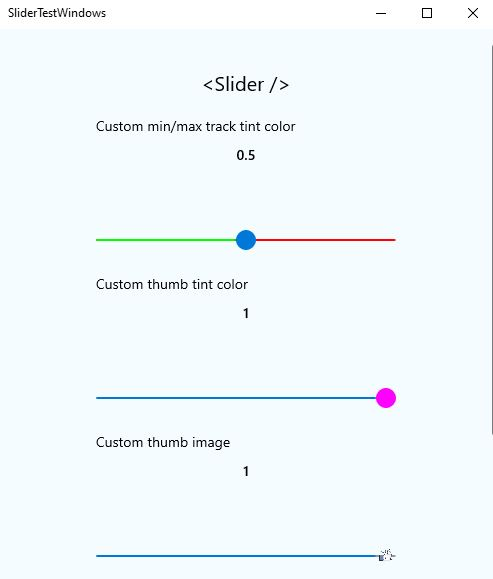

# `@react-native-community/slider`
[](https://circleci.com/gh/callstack/workflows/react-native-slider/tree/master)  

React Native component used to select a single value from a range of values.




## Getting started

`yarn add @react-native-community/slider`
or
`npm install @react-native-community/slider --save`

If using iOS, install cocoapods: `npx pod-install`

On Windows, autolinking is available from version 0.63. On 0.62 you need to [`manually link the module`](#Manual-linking-of-the-module-on-Windows) to your app. 
You can see the example app's code for how to do it.


## React Native Compatibility
To use this library you need to ensure you are using the correct version of React Native.

| `@react-native-community/slider` version | Required React Native Version |
| ---------------------------------------- | ----------------------------- |
| `4.x.x`                                  | `>=0.60`; `>=0.62` (on Windows);  |
| `3.1.x`                                  | `>=0.60`                      |
| `2.x.x`                                  | `>= 0.60`                     |
| [`1.x.x`](https://github.com/react-native-community/react-native-slider/tree/937f0942f1fffc6ed88b5cf7c88d73b7878f00f0)  | `<= 0.59`                     |

## Web support

For web support please use `@react-native-community/slider@next`

## Migrating from the core `react-native` module
This module was created when the Slider was split out from the core of React Native. To migrate to this module you need to follow the installation instructions above and then change you imports from:

```javascript
import { Slider } from 'react-native';
```

to:

```javascript
import Slider from '@react-native-community/slider';
```

## Usage

### Example

```javascript
import Slider from '@react-native-community/slider';
```

```javascript
  <Slider
    style={{width: 200, height: 40}}
    minimumValue={0}
    maximumValue={1}
    minimumTrackTintColor="#FFFFFF"
    maximumTrackTintColor="#000000"
  />
```

Check out the [example project](example) for more examples.

### Props

* [Inherited `View` props...](https://github.com/facebook/react-native-website/blob/master/docs/view.md#props)

- [`style`](#style)
- [`disabled`](#disabled)
- [`maximumValue`](#maximumvalue)
- [`minimumTrackTintColor`](#minimumtracktintcolor)
- [`minimumValue`](#minimumvalue)
- [`onSlidingStart`](#onslidingstart)
- [`onSlidingComplete`](#onslidingcomplete)
- [`onValueChange`](#onvaluechange)
- [`step`](#step)
- [`maximumTrackTintColor`](#maximumtracktintcolor)
- [`testID`](#testid)
- [`value`](#value)
- [`inverted`](#inverted)
- [`tapToSeek`](#tapToSeek)
- [`vertical`](#vertical)
- [`thumbTintColor`](#thumbtintcolor)
- [`maximumTrackImage`](#maximumtrackimage)
- [`minimumTrackImage`](#minimumtrackimage)
- [`thumbImage`](#thumbimage)
- [`trackImage`](#trackimage)
- [`ref`](#ref)

---

### `style`

Used to style and layout the `Slider`. See `StyleSheet.js` and `ViewStylePropTypes.js` for more info.

| Type       | Required |
| ---------- | -------- |
| View.style | No       |

---

### `disabled`

If true the user won't be able to move the slider. Default value is false.

| Type | Required |
| ---- | -------- |
| bool | No       |

---

### `maximumValue`

Initial maximum value of the slider. Default value is 1.

| Type   | Required |
| ------ | -------- |
| number | No       |

---

### `minimumTrackTintColor`

The color used for the track to the left of the button. Overrides the default blue gradient image on iOS.

| Type               | Required |
| ------------------ | -------- |
| [color](https://reactnative.dev/docs/colors) | No       |

---

### `minimumValue`

Initial minimum value of the slider. Default value is 0.

| Type   | Required |
| ------ | -------- |
| number | No       |

---

### `onSlidingStart`

Callback that is called when the user picks up the slider. The initial value is passed as an argument to the callback handler.

| Type     | Required |
| -------- | -------- |
| function | No       |

---

### `onSlidingComplete`

Callback that is called when the user releases the slider, regardless if the value has changed. The current value is passed as an argument to the callback handler.

| Type     | Required |
| -------- | -------- |
| function | No       |

---

### `onValueChange`

Callback continuously called while the user is dragging the slider.

| Type     | Required |
| -------- | -------- |
| function | No       |

---

### `step`

Step value of the slider. The value should be between 0 and (maximumValue - minimumValue). Default value is 0.

On Windows OS the default value is 1% of slider's range (from `minimumValue` to `maximumValue`).

| Type   | Required |
| ------ | -------- |
| number | No       |

---

### `maximumTrackTintColor`

The color used for the track to the right of the button. Overrides the default gray gradient image on iOS.

| Type               | Required |
| ------------------ | -------- |
| [color](https://reactnative.dev/docs/colors) | No       |

---

### `testID`

Used to locate this view in UI automation tests.

| Type   | Required |
| ------ | -------- |
| string | No       |

---

### `value`

Initial value of the slider. The value should be between minimumValue and maximumValue, which default to 0 and 1 respectively. Default value is 0.

_This is not a controlled component_, you don't need to update the value during dragging.

| Type   | Required |
| ------ | -------- |
| number | No       |

---

### `tapToSeek`
Permits tapping on the slider track to set the thumb position. Defaults to false on iOS. No effect on Android or Windows.

| Type | Required | Platform |
| ---- | -------- | -------- |
| bool | No       | iOS      |

---

### `inverted`
Reverses the direction of the slider. Default value is false.

| Type | Required |
| ---- | -------- |
| bool | No       |

---

### `vertical`
Changes the orientation of the slider to vertical, if set to `true`. Default value is false.

| Type | Required | Platform |
| ---- | -------- | -------- |
| bool | No       | Windows  |

---

### `thumbTintColor`

Color of the foreground switch grip.

| Type               | Required | Platform |
| ------------------ | -------- | -------- |
| [color](https://reactnative.dev/docs/colors) | No       | Android  |

---

### `maximumTrackImage`

Assigns a maximum track image. Only static images are supported. The leftmost pixel of the image will be stretched to fill the track.

| Type                   | Required | Platform |
| ---------------------- | -------- | -------- |
| Image.propTypes.source | No       | iOS      |

### `minimumTrackImage`

Assigns a minimum track image. Only static images are supported. The rightmost pixel of the image will be stretched to fill the track.

| Type                   | Required | Platform |
| ---------------------- | -------- | -------- |
| Image.propTypes.source | No       | iOS      |

---

### `thumbImage`

Sets an image for the thumb. Only static images are supported. Needs to be a URI of a local or network image; base64-encoded SVG is not supported.


| Type                   | Required | 
| ---------------------- | -------- | 
| Image.propTypes.source | No       | 

---

### `trackImage`

Assigns a single image for the track. Only static images are supported. The center pixel of the image will be stretched to fill the track.

| Type                   | Required | Platform |
| ---------------------- | -------- | -------- |
| Image.propTypes.source | No       | iOS      |

---

### `ref`

Reference object.

| Type             | Required | Platform |
| ---------------- | -------- | -------- |
| MutableRefObject | No       | web      |

## Contributing

This project uses [yarn workspaces](https://classic.yarnpkg.com/en/docs/workspaces/) to handle its internal dependencies.
Make sure to use `yarn` to install dependencies

```sh
yarn install
```

Make sure your code passes Flow, ESLint and the tests. Run the following to verify:

```sh
yarn validate:flow
yarn validate:eslint
yarn test:jest
```

or 

```sh
yarn test
```
to run them all.

To fix formatting errors, run the following:

```sh
yarn validate:eslint --fix
```
Remember to cover your changes with tests if possible.

# Running the example app 
While developing, you can run the example app to test your changes.

## Setup

- Clone the repository 
- Run `yarn` in the root directory to install dependencies, and again in `src` to create the dist build.
- (on iOS) Run `npx pod-install` from the `example` directory
- (on Windows) You need to manually link the Slider module to your project.

## Start the app

- Run `yarn run:android` to run on Android
- Run `yarn run:ios` to run on iOS
- Run `yarn run:web` to run on web
- Run `yarn run:windows` to run on Windows.

# Manual linking of the module on Windows
On Windows, you need to manually link the `Slider` native module to your project.

#### Add the SliderWindows project to your solution

1. Open the solution in Visual Studio 2019.
2. Right-click solution icon in Solution Explorer > Add > Existing Project.
   Select 'D:\pathToYourApp\node_modules\@react-native-community\slider\windows\SliderWindows\SliderWindows.vcxproj'.

#### **windows/myapp.sln**

Add a reference to `SliderWindows` to your main application project. From Visual Studio 2019:

Right-click main application project > Add > Reference...
Check 'SliderWindows' from the 'Project > Solution' tab on the left.

#### **pch.h**

Add `#include "winrt/SliderWindows.h"`.

#### **app.cpp**

Add `PackageProviders().Append(winrt::SliderWindows::ReactPackageProvider());` before `InitializeComponent();`.


## Maintainers

- [Michał Chudziak](https://github.com/michalchudziak) - [Callstack](https://callstack.com/)
- [Wojciech Szafraniec](https://github.com/wojteg1337) - [Callstack](https://callstack.com/)

## Contributors

This module was extracted from `react-native` core. Please, refer to https://github.com/react-native-community/react-native-slider/graphs/contributors for the complete list of contributors.

## License
The library is released under the MIT licence. For more information see `LICENSE`.
